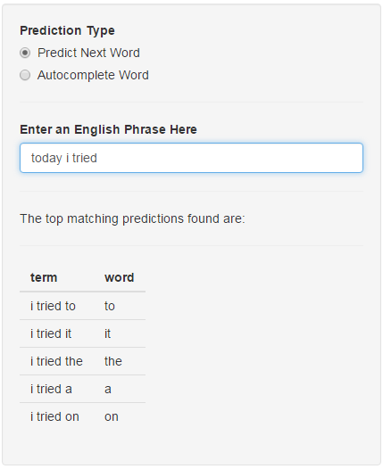

Coursera Data Science Capstone Project: Word Prediction and Autocompletion
========================================================
author: David Rothall
date: 28 March 2017
autosize: true

Background
========================================================
The autocorrection technology implemented by [Swiftkey](https://swiftkey.com/en) is very effective in learning and predicting what users want to type on their keyboards.

This project aims to sample text from Twitter, blogs and news articles in order to generate a simple program which predicts or autocompletes a word given a sample phrase from a user.

[Data](https://d396qusza40orc.cloudfront.net/dsscapstone/dataset/Coursera-SwiftKey.zip) supplied by [HC Corpora](www.heliohost.org)  

The final app was designed as part of the Capstone project for the Data Science Specialization on the Coursera Website. It contains 10 courses which were very interesting and engaging and I'd recommend anyone considering learning Data Science to study it.

Shiny App
========================================================

*** 
Try out the Shiny app [here!](https://the-roth.shinyapps.io/Course-10/)

The app contains useful information about:
- How the app works
- Supporting documentation
- Detailed improvements to the model.

These improvements will be added in the future

Method / Prediction Algorithm
========================================================
- 240000 article sample of blogs, news and Twitter posts - Remove punctuation, numbers, profanity, whitespace
- Extract n-gram phrases up to n = 4

1. Extract (up to) the last 3 words from a phrase by the user
2. Return top X last words from either quadgrams or trigrams datasets depending on user preference (next word prediction vs autocompletion)
3. If < 5 results found, repeat 2 with the last 2 words in phrase, using trigrams / bigrams datasets
4. Repeat 3 using bigrams / unigrams for the last word in phrase

Improvements
========================================================
- Try different data sets to broaden grammar use
- The current algorithm uses maximum likelihood predictions only
- Implement Katz' backoff / Kneser-Ney Smoothing models to improve prediction accuracy
- Include German and Russian predictions as well

Please see the improvements section of the Shiny app for further details!
